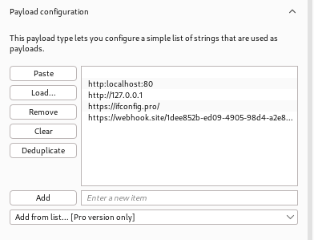
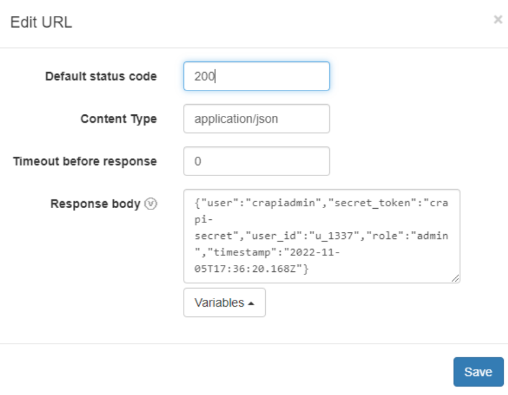
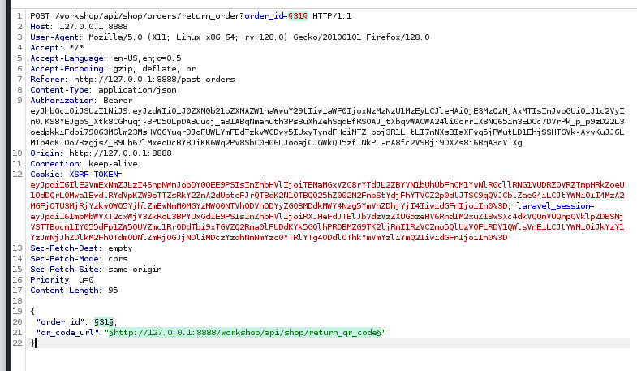

## APISEC Server-Side Request Forgery notes

This is a vulnerability that relates to an application retrieving remote resources without validating user input. An atatcker could put their own input into the URL to control remote resources and gain access to sensitive data or completely compromise a vulnerable host. This is one of the OWASP top 10 vulnerabilities.

## In-band SSRF
This type of SSRF displays the content of your supllied URL back to you in a response
By gaining information and control over the URL you could potentially gather sensitive information or attempt to perform a RCE attack.

Example:
```
Intercepted Request:

POST api/v1/store/products
headers…
{
    "inventory":"http://store.com/api/v3/inventory/item/12345"
}

Attack:

POST api/v1/store/products
headers…
{
    "inventory":"§http://localhost/secrets§"
}

Response:

HTTP/1.1 200 OK
headers...
{
    "secret_token":"crapi-admin"
}
```

## Blind SSRF
This is like In-band but doesn't send a response back to the user, but the server does make a request to the specified URL. You would need to have some control over the web server to take advantage of this.


## Ingredients for SSRF vulnerabilities
You will want to look for requests that have something of the following:
- full URLs in the POST body or parameters
- Include URL paths (or partial URLs) in the POST body or parameters
- Headers that include URLs like Referer
- Allows for use input that mayresult in a server retrieving resources

We're going to be targeting the following endpoints to see if theres any potential in SSRF:

- POST /community/api/v2/community/posts
- POST /workshop/api/shop/orders/return_order?order_id=4000
- POST /workshop/api/merchant/contact_mechanic

We target these endpoints with following kind of payloads:


We also create a webhook that contains the following information at webhook.site:


We then test out the first endpoint, but this doesn't really bring out anything interesting, so we move on to the return_order endpoint. Here we need to load payloads where the order_id increases by one for every payload.



Again, no luck were not able to change the qr_code_url with this so we move on to test the last endpoint.

When we run the same payloads against the last endpoint we get a successful response from couple of the payloads! The webhook payload proved that there was an In-band SSRF vulnerability! If the crAPI wasn't just a singular container, but instead contained multiple different ones, which would only be accessible through crAPI container, we could then gain information from this endpoint about those other containers by running different kinds of payloads!

In the assignment we ran a similar type of payloads against the only endpoint that included full URLs in the post body, and the response contained what we expected from the ```https://ifconfig.pro/``` and ```https://webhook...``` payloads!
